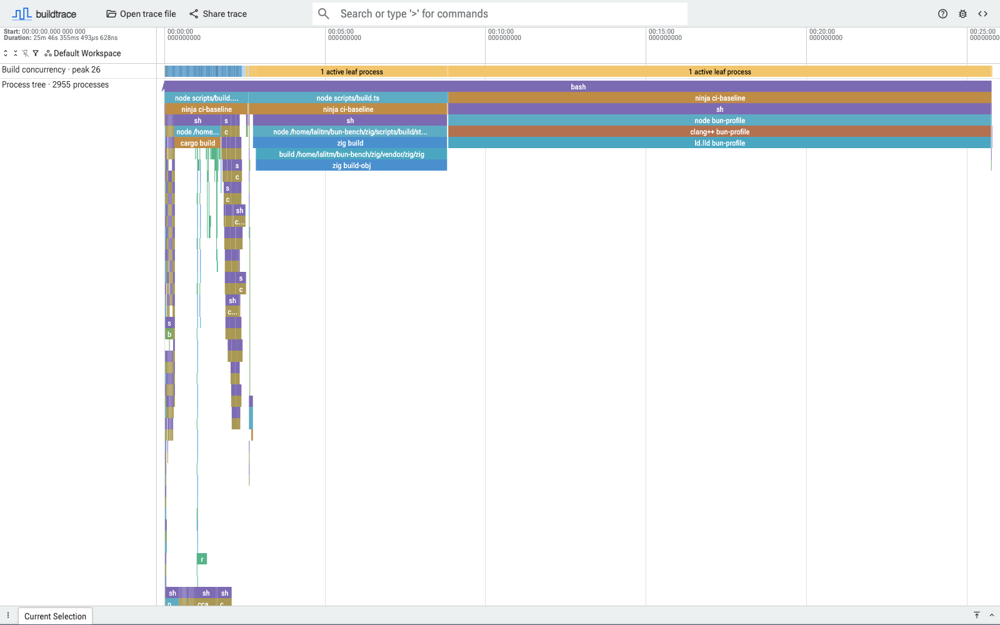

# Buildprof

Buildprof is a profiler for software builds. It records every descendant
process in a Linux build and turns the result into an interactive timeline you
can explore in the browser.

It works below any individual build system, so the same view can include Cargo
crates, Ninja jobs, compiler and linker invocations, shell scripts, code
generators, file access, and arbitrary tools launched along the way.



## Why use Buildprof?

Build tools generally explain only the work they manage themselves. Cargo
timings cannot break down an arbitrary `build.rs` script; Ninja cannot see
inside commands it launches; compiler traces describe one compiler invocation
rather than the build around it.

Buildprof follows the complete process tree instead. It lets you:

- see where wall-clock time went across the whole build;
- spot work which ran serially, overlapped, or started unexpectedly late;
- inspect full commands, working directories, lifetimes, and exit statuses;
- follow files from the process which produced them to processes which read
  them;
- use the same profiler with Make, Ninja, CMake, Meson, Cargo, Go, or wrapper
  scripts; and
- optionally add compiler-internal phases from Clang, LLD, and nightly Rust.

The recording is a Perfetto protobuf trace. The UI processes it locally in
your browser and recordings can also be queried with Perfetto Trace Processor.

## Quick start

Buildprof currently requires Linux. Install it from crates.io:

```console
cargo install buildprof --locked
```

Put the build command after `--`:

```console
buildprof -- cargo build --release
```

The recording is written to `output.buildprof`. In an interactive graphical
session, Buildprof also serves it from localhost and opens
[buildprof.lalitm.com](https://buildprof.lalitm.com) automatically. The trace is
fetched directly by your browser and is not uploaded.

Choose another output path or disable automatic opening when needed:

```console
buildprof -o clean-build.buildprof --no-open -- make -j8
```

Open an existing recording later with:

```console
buildprof open clean-build.buildprof
```

Recordings contain command lines and filesystem paths. Review them before
sharing them.

## Compiler details

Process timing is usually the right level for understanding a build. When a
particular compiler or linker invocation needs a closer look, enable compiler
tracing:

```console
buildprof --compiler-traces -- cargo build
```

Buildprof currently imports Clang `-ftime-trace`, explicitly selected LLD
`--time-trace`, and nightly Rust self-profile data. These events appear as a
summary of active compiler threads with expandable per-thread phase tracks.

A build which invokes Clang through an absolute path currently bypasses
compiler tracing. Buildprof will still record the compiler process, but its
Clang and LLD internal phases will be absent.

Compiler tracing can also change compiler cache keys or turn cache hits into
misses. Existing Rust compiler wrappers remain in the invocation chain, but
cache preservation is not guaranteed in this mode.

## How it works

On Linux, Buildprof launches the command under `ptrace` and follows process
creation, execution, and exit through the complete descendant tree. A seccomp
filter lets it stop only for the filesystem operations it records instead of
paying the cost of intercepting every system call.

The recorder writes a Perfetto protobuf trace directly. Perfetto provides the
storage format, query engine, and core timeline interactions; Buildprof adds
the build-specific view on top, including process ancestry, command types,
concurrency, file relationships, and optional compiler timing data.

Because recording follows descendants, work delegated to an existing daemon,
a remote executor, or another machine is outside the trace. Use local or
no-daemon execution modes when a build system provides them.

## Requirements

- Linux with a kernel or container configuration that permits tracing child
  processes
- Rust 1.85 or newer when installing from source

## Development

Run the complete conformance suite in the Linux development container:

```console
just bootstrap
just test
```

For a quick host-side check of formatting, lints, unit tests, and package
contents:

```console
just release-check
```

## License

Licensed under the Apache License, Version 2.0. See [LICENSE](LICENSE) and
[AUTHORS](AUTHORS).
