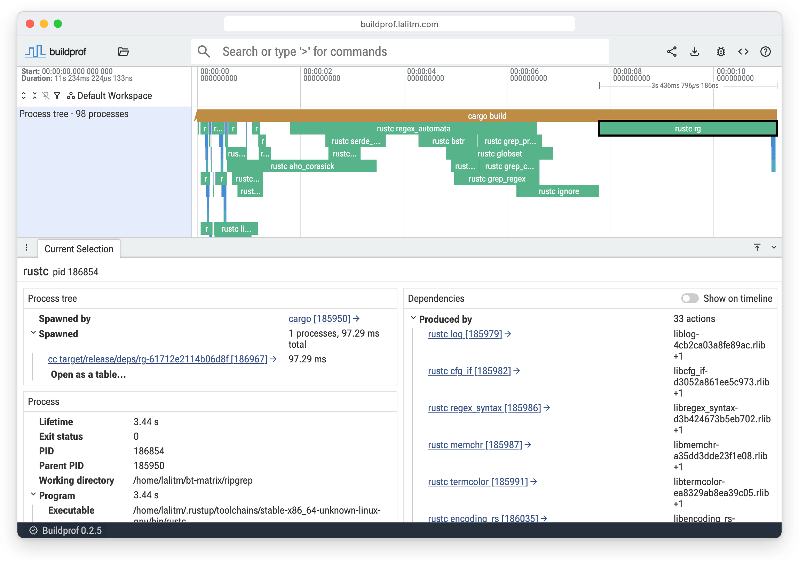

# Buildprof

Buildprof is a profiler for software builds. It records every descendant
process in a Linux build and turns the result into an interactive timeline you
can explore in the browser.

It works below any individual build system, so the same view can include Cargo
crates, Ninja jobs, compiler and linker invocations, shell scripts, code
generators, file access, and arbitrary tools launched along the way.



## Why use Buildprof?

Build tools generally explain only the work they manage themselves. Cargo
timings cannot break down an arbitrary `build.rs` script; Ninja cannot see
inside commands it launches; compiler traces describe one compiler invocation
rather than the build around it.

Buildprof follows the complete process tree instead. It lets you:

- see where wall-clock time went across the whole build;
- spot work which ran serially, overlapped, or started unexpectedly late;
- inspect full commands, working directories, lifetimes, and exit statuses;
- follow files from the process which produced them to processes which read
  them;
- use the same profiler with Make, Ninja, CMake, Meson, Cargo, Go, or wrapper
  scripts; and
- optionally add compiler-internal phases from Clang, LLD, and nightly Rust.

The recording is a Perfetto protobuf trace. The UI processes it locally in
your browser and recordings can also be queried with Perfetto Trace Processor.

## Install

Recording requires Linux. Use whichever of these you already have (see the
[Releases page](https://github.com/LalitMaganti/buildprof/releases/latest)
for more options):

```bash
curl -fsSL https://buildprof.lalitm.com/install.sh | sh
```

```bash
brew install lalitmaganti/tap/buildprof
```

```bash
mise use -g github:LalitMaganti/buildprof
```

## Usage

Either open our
[example recording of a ripgrep release build](https://buildprof.lalitm.com/#!/?url=https://buildprof.lalitm.com/examples/ripgrep-release-clean.buildprof),
which needs nothing installed, or record your own build by putting
`buildprof --` in front of the build command:

```bash
buildprof -- make -j8
buildprof -- ninja -C out
buildprof -- cargo build
buildprof -- go build ./...
```

When the build finishes, the recording is saved as `output.buildprof` and
opens in your browser at [buildprof.lalitm.com](https://buildprof.lalitm.com).
The trace is served from localhost and never uploaded. Any build system
works; see [Build systems](#build-systems).

### Options

Choose another output path or disable automatic opening when needed:

```bash
buildprof -o clean-build.buildprof --no-open -- ninja -C out
```

Open an existing recording later with:

```bash
buildprof open clean-build.buildprof
```

Recordings contain command lines and filesystem paths. Review them before
sharing them.

### Builds on a remote machine

Over SSH there is no browser to launch, so Buildprof prints the port forward
to run from your own machine instead and waits for the browser to fetch the
trace:

```bash
ssh -L 9001:127.0.0.1:9001 user@buildhost
```

VS Code Remote and JetBrains Gateway forward the port automatically. The wait
gives up after ten minutes; adjust it with `--wait <SECONDS>`, where `0` waits
forever. Alternatively, copy the recording to any machine with Buildprof
installed and run `buildprof open` there; the macOS build exists for exactly
that.

## Build systems

Buildprof follows the process tree, so it does not need to understand the
build system. These are exercised by the conformance suite on every change:

- **Make**: compiles, archiving, linking, and renamed outputs.
- **CMake with Ninja**: the configure step and the Ninja build.
- **Meson with Ninja**: the setup step and the Ninja build.
- **Cargo**: `rustc` invocations and linking; nightly self-profile data with
  `--compiler-traces`.
- **Go**: compile, assemble, and link.

Anything else that runs as a child process is recorded the same way: shell
scripts, code generators, wrapper scripts, and tools launched by the build.
Work handed to a daemon or a remote executor happens outside the process tree
and is not visible; use local or no-daemon modes where a build system offers
them.

## Compiler details

Process timing is usually the right level for understanding a build. When a
particular compiler or linker invocation needs a closer look, enable compiler
tracing:

```bash
buildprof --compiler-traces -- cargo build
```

Buildprof currently imports Clang `-ftime-trace`, explicitly selected LLD
`--time-trace`, and nightly Rust self-profile data. These events appear as a
summary of active compiler threads with expandable per-thread phase tracks.

A build which invokes Clang through an absolute path currently bypasses
compiler tracing. Buildprof will still record the compiler process, but its
Clang and LLD internal phases will be absent.

Compiler tracing can also change compiler cache keys or turn cache hits into
misses. Existing Rust compiler wrappers remain in the invocation chain, but
cache preservation is not guaranteed in this mode.

## How it works

On Linux, Buildprof launches the command under `ptrace` and follows process
creation, execution, and exit through the complete descendant tree. A seccomp
filter lets it stop only for the filesystem operations it records instead of
paying the cost of intercepting every system call.

The recorder writes a Perfetto protobuf trace directly. Perfetto provides the
storage format, query engine, and core timeline interactions; Buildprof adds
the build-specific view on top, including process ancestry, command types,
concurrency, file relationships, and optional compiler timing data.

Because recording follows descendants, work delegated to an existing daemon,
a remote executor, or another machine is outside the trace. Use local or
no-daemon execution modes when a build system provides them.

## Backwards compatibility

Before 1.0, the CLI and the UI move in lockstep: a recording is meant to be
viewed in the UI released with the same version. Every UI version stays
deployed under its own path, the CLI opens the one matching its version, and
the UI links to the matching version when it is handed a recording from a
different release, so nothing stops working, but the trace format may change
between releases.

From 1.0 onward, the trace format is stable and compatibility is permanent:
any recording opens in every later UI, and newer UIs simply add features on
top of older recordings.

## Self-hosting the UI

Each release attaches `buildprof-ui-v<version>.tar.zst`, the complete UI as
static files. Serve its contents from any web server and point the CLI at it:

```bash
buildprof open --url https://ui.example.internal/v0.2.0 clean-build.buildprof
```

## Requirements

- Linux with a kernel or container configuration that permits tracing child
  processes: Docker needs `--cap-add SYS_PTRACE`, `kernel.yama.ptrace_scope`
  must be below 3, and gVisor-style sandboxes cannot trace at all
- Rust 1.91 or newer when installing from source

## Development

See [CONTRIBUTING.md](CONTRIBUTING.md) for the layout and the UI workflow.
Run the complete conformance suite in the Linux development container:

```bash
just bootstrap
just test
```

For a quick host-side check of formatting, lints, unit tests, and package
contents:

```bash
just release-check
```

## License

Licensed under the Apache License, Version 2.0. See [LICENSE](LICENSE) and
[AUTHORS](AUTHORS).
