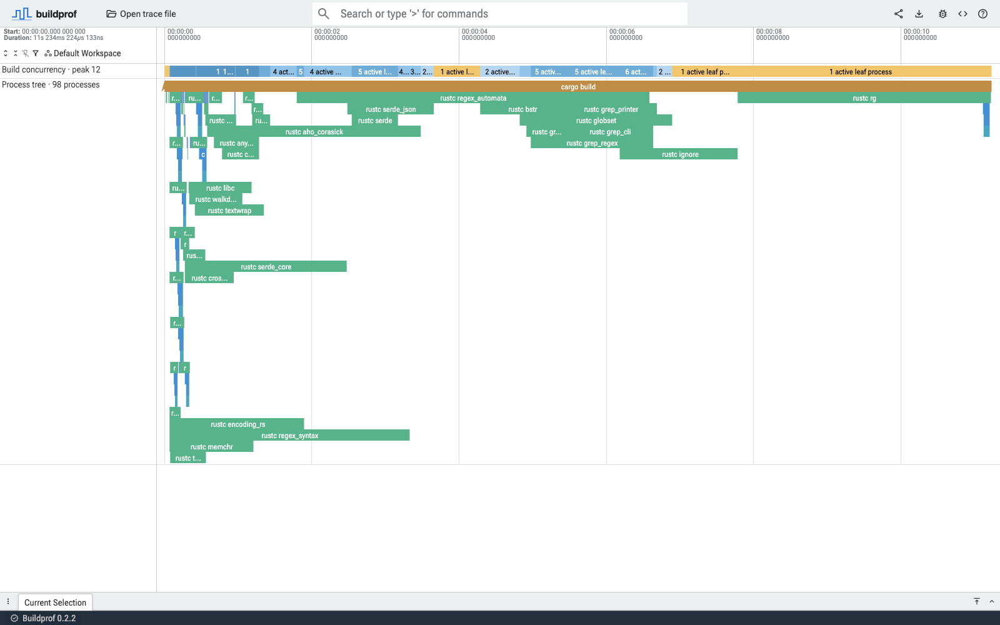
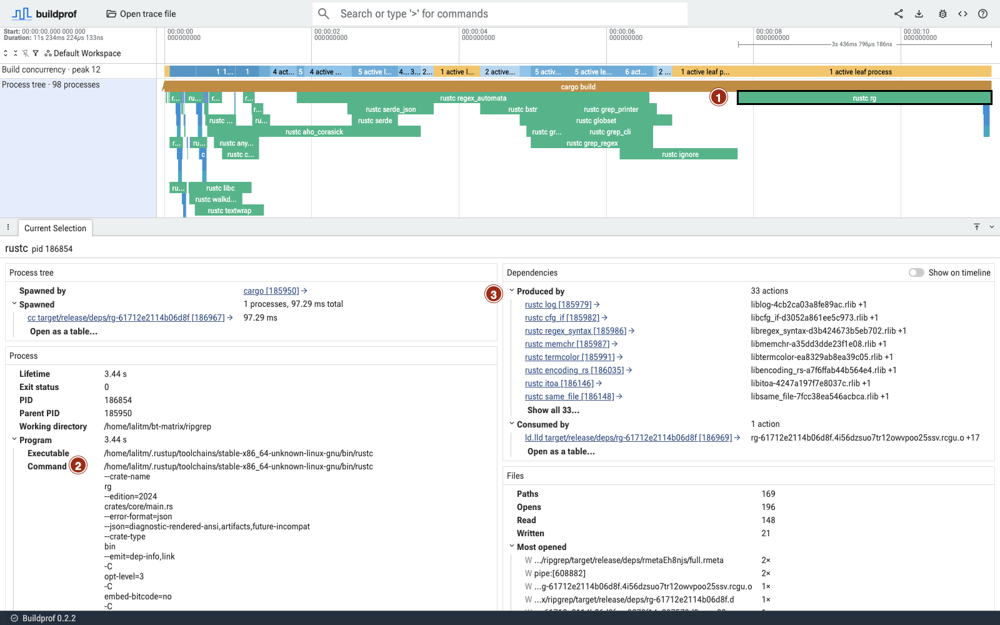

# Explore a ripgrep build

This tour uses a recorded clean release build of ripgrep to practice reading
the timeline, inspecting a command, and following a file relationship. You
only need a browser; there is no need to install Buildprof or compile ripgrep.

## 1. Open the recording

Open the [ripgrep release build](https://buildprof.lalitm.com/#!/?url=https://buildprof.lalitm.com/examples/ripgrep-release-clean.buildprof).
If you already have Buildprof installed, `buildprof open --example ripgrep`
opens the same example.

The screenshots below use the bundled 0.2.2 recording: about 11.23 seconds,
98 processes, and peak concurrency of 12. The hosted example may be replaced
with a newer recording; exact times, process IDs, and layout can then differ.

Find the long **cargo build** bar. The green `rustc` bars beneath it are crate
compilations. Several overlap early in the recording, while **rustc rg** runs
near the end after the other crates finish. The short bars below its right
edge form the final linking chain.

## 2. Inspect the final crate

Click **rustc rg**, the long green bar near the right end of the timeline.
Drag the divider above **Current Selection** upward if you need more room
for the details.

Find these three items:

1. The outlined bar is your selected process. Its lifetime is about **3.44 s**.
2. Under **Process → Program → Command**, the arguments include
   `--crate-name rg` and `crates/core/main.rs`. This identifies what Rust was
   compiling. The working directory tells you where that relative path starts.
3. Under **Dependencies → Produced by**, you can see the processes which
   produced its inputs. There are **33 actions** in this recording.

Under **Process tree → Spawned**, notice the short `cc` command. Follow that
process link, then its children, to inspect the linking chain. Each selection
shows that process's own command and lifetime. Click the original `rustc rg`
bar again to return to it.

## 3. Follow an input to its producer

Under **Produced by**, click **rustc log**. The file shown alongside it begins
with `liblog` and ends in `.rlib`; it is a compiled Rust library consumed by
the final crate.

Buildprof selects that earlier compiler process and brings it into view.
Its command identifies the `log` crate. You have moved from a consumer to
the process which produced one of its inputs, without needing to know
Cargo's internal build graph.

Use **Consumed by** to find and follow the link back to **rustc rg**. These
links describe observed file use; they do not by themselves establish why
the build system chose a particular start time.

## 4. Examine the serial tail

Click the yellow interval in **Build concurrency** above the middle of the
`rustc rg` bar. The details should show **1 active leaf process** and a link
to `rustc rg`. Cargo is still alive, but its running child means Cargo does
not add another leaf to the count.

This explains the timeline's shape: most crate compilations have finished,
leaving the final crate. It does not tell us how many CPU cores that compiler
is using internally.

## 5. Summarize the earlier work

Return to the earlier part of the timeline with **A / D** to pan and **W / S**
to zoom if needed. Click and drag across the **Process tree** track over
roughly seconds 2–6. Open **Build aggregation** in the bottom panel.

Choose **Tool**. Expand the `rustc` group to see individual compilations,
then choose **Action** to group by their labels or **Directory** to group by
working directory. You should see several Rust compilations in this earlier
window, in contrast to the single process in the tail.

The totals sum full lifetimes of overlapping processes which never spawned
children. They are not clipped to the selection, and parallel work adds
together. Do not compare the sum directly with the window's elapsed time.

## Apply this to your build

You have inspected a compiler command, followed an input to its producer,
and compared a parallel interval with a serial tail. Use the
[investigation guide](investigating-builds.md) to repeat those steps on your
own build and collect compiler details when a process needs a closer look.
The selected `rustc rg` process has no compiler-internal phase tracks; those
require another recording with compiler tracing enabled and nightly Rust.
