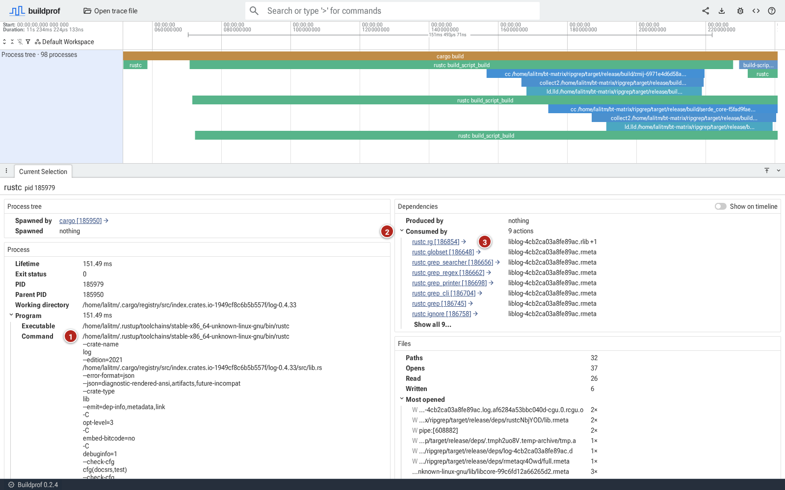
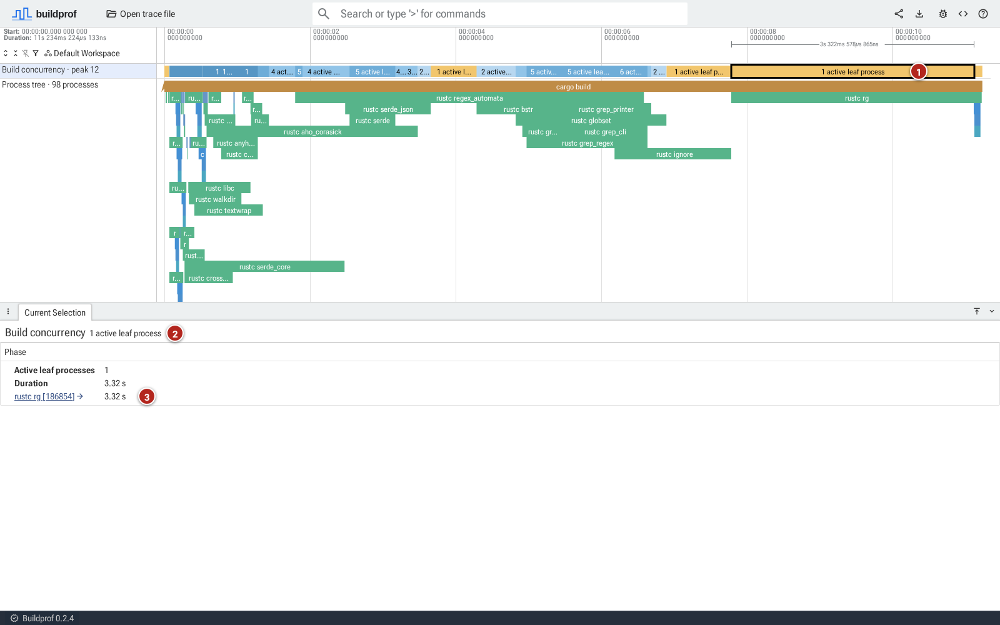
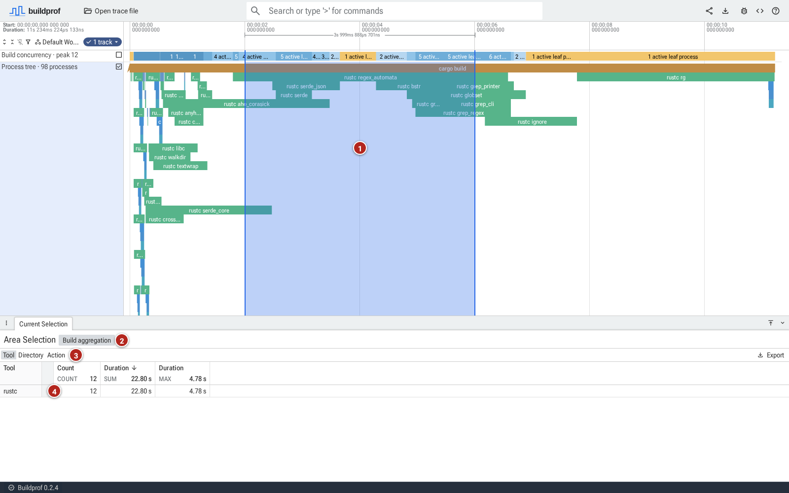

# Explore a ripgrep build

This tour uses a recorded clean release build of ripgrep to practice reading
the timeline, inspecting a command, and following a file relationship. You
only need a browser; there is no need to install Buildprof or compile ripgrep.

## 1. Open the recording

Open the [ripgrep release build](https://buildprof.lalitm.com/#!/?url=https://buildprof.lalitm.com/examples/ripgrep-release-clean.buildprof).
If you already have Buildprof installed, `buildprof open --example ripgrep`
opens the same example.

The screenshots below show the hosted recording in Buildprof 0.2.4: about
11.23 seconds, 98 processes, and peak concurrency of 12. The hosted example
may be replaced with a newer recording; exact times, process IDs, and layout
can then differ.

1. The long **cargo build** bar spans the whole build. The green `rustc` bars
   beneath it are crate compilations; several overlap early in the recording.
2. **rustc rg** runs near the end, after the other crates finish.
3. The short bars below its right edge form the final linking chain.

## 2. Inspect the final crate

Click **rustc rg**, the long green bar near the right end of the timeline.
Drag the divider above **Current Selection** upward if you need more room
for the details.

1. The outlined bar is your selected process. Its lifetime is about **3.44 s**.
2. Under **Process → Program → Command**, the arguments include
   `--crate-name rg` and `crates/core/main.rs`. This identifies what Rust was
   compiling. The working directory tells you where that relative path starts.
3. Under **Dependencies → Produced by**, you can see the processes which
   produced its inputs. There are **33 actions** in this recording.
4. Under **Process tree → Spawned**, the short `cc` command is the start of
   the linking chain. Follow that process link, then its children, to inspect
   the chain. Each selection shows that process's own command and lifetime.
   Click the original `rustc rg` bar again to return to it.

## 3. Follow an input to its producer

Under **Produced by**, click **rustc log**. The file shown alongside it begins
with `liblog` and ends in `.rlib`; it is a compiled Rust library consumed by
the final crate.

Buildprof selects that earlier compiler process and zooms the timeline in
around it.

1. Its command identifies the `log` crate. You have moved from a consumer to
   the process which produced one of its inputs, without needing to know
   Cargo's internal build graph.
2. **Consumed by** follows the relationship in the other direction: nine
   later compilations read the `log` crate's outputs.
3. The first of them is **rustc rg**. Click it to return. These links describe
   observed file use; they do not by themselves establish why the build
   system chose a particular start time.

## 4. Examine the serial tail

Reload the example, or zoom back out with **W / S** and pan with **A / D**,
so the whole build is visible again. Then click the yellow interval in
**Build concurrency** above the middle of the `rustc rg` bar.

1. The outlined interval lasts about 3.3 seconds.
2. The details show **1 active leaf process**. Cargo is still alive, but its
   running child means Cargo does not add another leaf to the count.
3. The one process is **rustc rg**.

This explains the timeline's shape: most crate compilations have finished,
leaving the final crate. It does not tell us how many CPU cores that compiler
is using internally.

## 5. Summarize the earlier work

Click and drag across the **Process tree** track over roughly seconds 2–6.
Then open **Build aggregation** in the bottom panel.

1. The shaded region is the selected time range.
2. **Build aggregation** summarizes the processes in that range.
3. **Tool**, **Directory**, and **Action** choose how to group them.
4. Grouped by **Tool**, the `rustc` group holds about a dozen Rust
   compilations in this window, in contrast to the single process in the
   tail. Click the row to list the individual compilations; **Back to pivot**
   returns to the groups.

The totals sum full lifetimes of overlapping processes which never spawned
children. They are not clipped to the selection, and parallel work adds
together. Do not compare the sum directly with the window's elapsed time.

## Apply this to your build

You have inspected a compiler command, followed an input to its producer,
and compared a parallel interval with a serial tail. Use the
[investigation guide](investigating-builds.md) to repeat those steps on your
own build and collect compiler details when a process needs a closer look.
The selected `rustc rg` process has no compiler-internal phase tracks; those
require another recording with compiler tracing enabled and nightly Rust.
